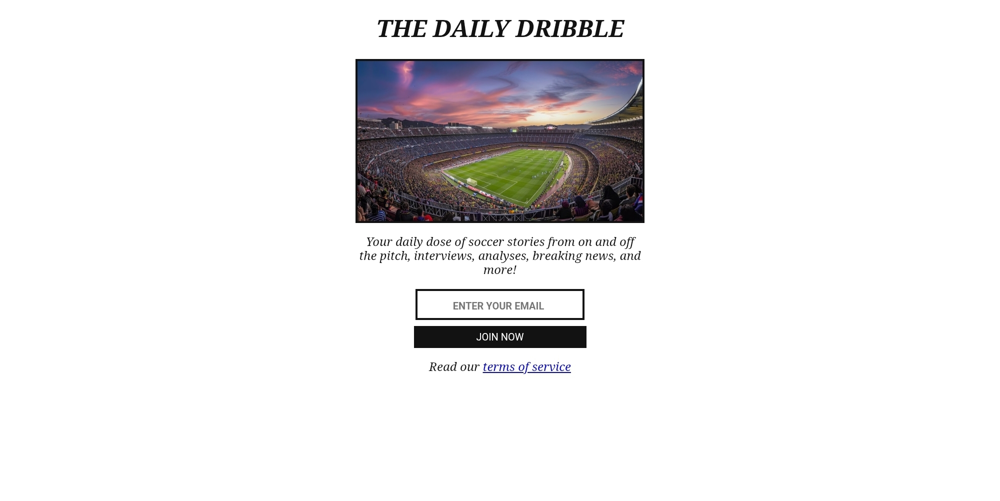

# The Daily Dribble Newsletter

A static website developed independently with Scrimba using HTML & CSS for daily dribble newsletter.

## Description

This website is a part of solo projects that was made during Scrimba's <a href="https://scrimba.com/learn-html-and-css-c0p/" target="_blank">HTML & CSS course</a>. It uses different key HTML features and concepts, such as inputs, buttons, images, classes, and paragraphs, and also uses key difference CSS features and concepts, such as margins to center the elements, block display, border, padding, and font weight.

## Technologies Used
* HTML5
* CSS3

## Key Learning Outcomes

- Used buttons, inputs, and images to give the website a good shape and usability.
- Linked the HTML file with CSS file.
- Centered the content using display and aligning.
- Gave the elements a wonderful shape using borders and padding.

## Live Demo
Check out the live demo here: https://daily-dribble-newsletter0.netlify.app/

## Contributing

Suggestions and feedback are welcome! feel free to:
* Suggest new features.
* Share best practices.

## Conclusion

I'm eager to apply these skills in real-world project. I will continue doing projects with this wonderful <a href="https://scrimba.com/learn-html-and-css-c0p/" target="_blank">course</a> from <a href="https://scrimba.com/" target="_blank">Scrimba</a>.
